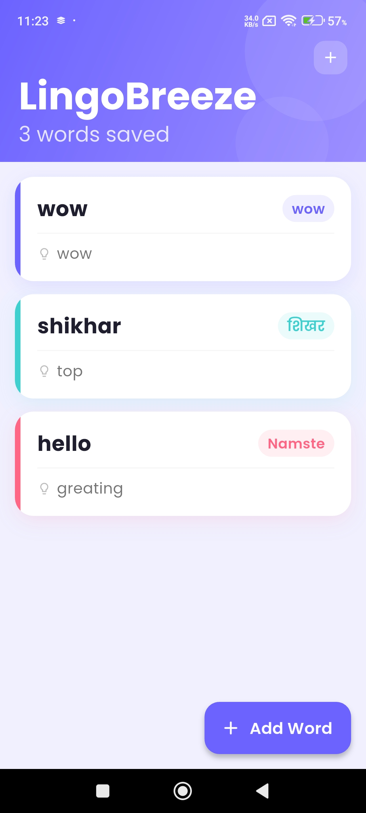
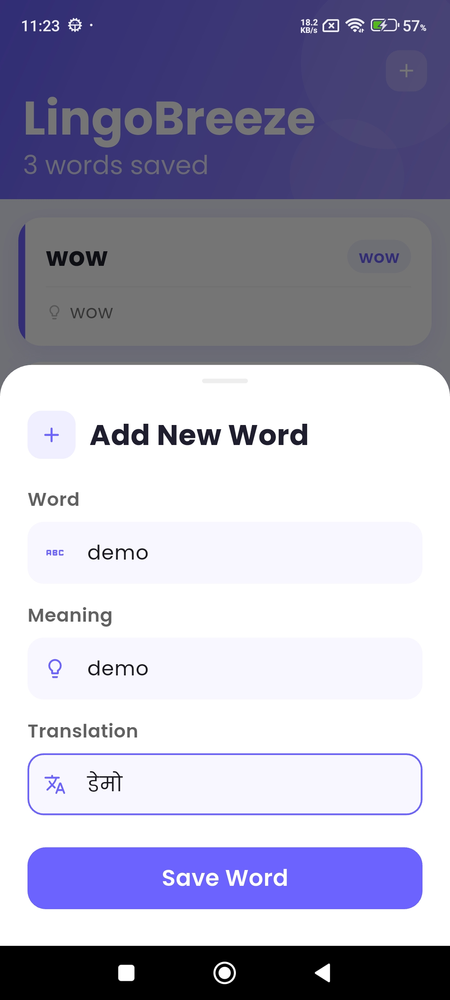
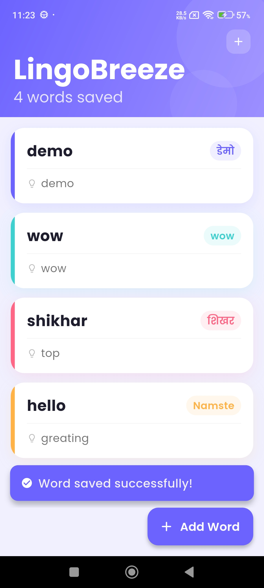
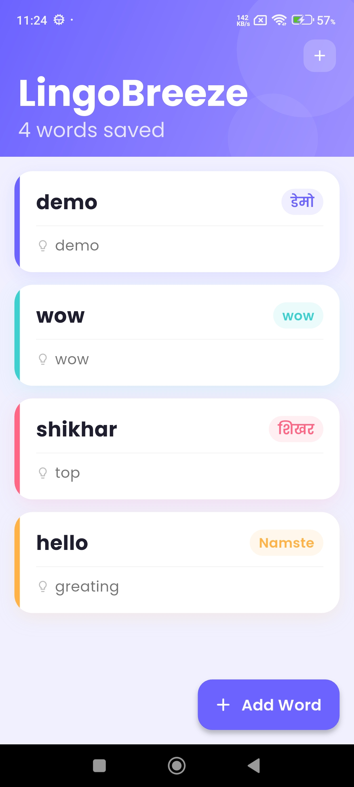

# LingoBreeze 📚

A vocabulary learning app built with Flutter, Node.js, and Firebase. Users can save vocabulary words they want to learn and view them in a clean, modern list.

---

## Features

- Add new words with meaning and translation
- View all saved words
- Loading, empty, and error states
- Pull to refresh
- Modal bottom sheet for adding words
- Firebase Firestore for storage

---
## Screenshots

<table>
  <tr>
    <td></td>
    <td></td>
    <td></td>
    <td></td>
  </tr>
  <tr>
    <td align="center">Vocabulary List</td>
    <td align="center">Add New Word</td>
    <td align="center">Word Saved</td>
    <td align="center">Updated List</td>
  </tr>
</table>

## Tech Stack

| Layer | Technology |
|-------|------------|
| Frontend | Flutter |
| State Management | Provider |
| Backend | Node.js + Express |
| Database | Firebase Firestore |
| Architecture | Clean Architecture |

---

## Project Structure

```text
lingbreeze/
├── flutter_app/
│   ├── lib/
│   │   ├── core/
│   │   │   └── constants.dart
│   │   ├── data/
│   │   │   ├── models/
│   │   │   │   └── word_model.dart
│   │   │   └── repositories/
│   │   │       └── word_repository.dart
│   │   ├── presentation/
│   │   │   ├── providers/
│   │   │   │   └── word_provider.dart
│   │   │   └── screens/
│   │   │       ├── vocabulary_screen.dart
│   │   │       └── widgets/
│   │   │           ├── word_card.dart
│   │   │           ├── add_word_sheet.dart
│   │   │           └── empty_state.dart
│   │   └── main.dart
│   ├── android/
│   ├── ios/
│   └── pubspec.yaml
├── backend/
│   ├── index.js
│   └── package.json
├── .gitignore
└── README.md
```

---
---

## Getting Started

### Prerequisites

- Flutter 3.x+
- Node.js 18+
- Firebase project with Firestore enabled

---

### Backend Setup

```bash
cd backend
npm install
```

Add `serviceAccountKey.json` file in the `backend/` folder:
- Go to Firebase Console
- Project Settings → Service Accounts
- Click "Generate new private key"
- Save the downloaded file as `serviceAccountKey.json` inside `backend/`

Start the server:

```bash
node index.js
```

Server will run on `http://localhost:3000`

---

### API Endpoints

| Method | Endpoint | Description |
|--------|----------|-------------|
| GET | /words | Fetch all saved words |
| POST | /words | Save a new word |

**POST /words — Request Body:**

```json
{
  "word": "Apple",
  "meaning": "A round fruit",
  "translation": "Manzana"
}
```

---

### Flutter App Setup

```bash
cd flutter_app
flutter pub get
```

Update the backend URL in `lib/core/constants.dart`:

```dart
class AppConstants {
  // For Android emulator
  static const String baseUrl = 'http://10.0.2.2:3000';

  // For real device — use your machine's WiFi IP
  // static const String baseUrl = 'http://192.168.1.XX:3000';
}
```

Run the app:

```bash
flutter run
```

---

## Notes

- `serviceAccountKey.json` is not committed to this repository for security reasons
- Make sure your phone and laptop are on the same WiFi network when testing on a real device
- Backend must be running before launching the Flutter app

---

## Built With

- [Flutter](https://flutter.dev)
- [Provider](https://pub.dev/packages/provider)
- [Firebase Firestore](https://firebase.google.com/docs/firestore)
- [Node.js](https://nodejs.org)
- [Express](https://expressjs.com)
